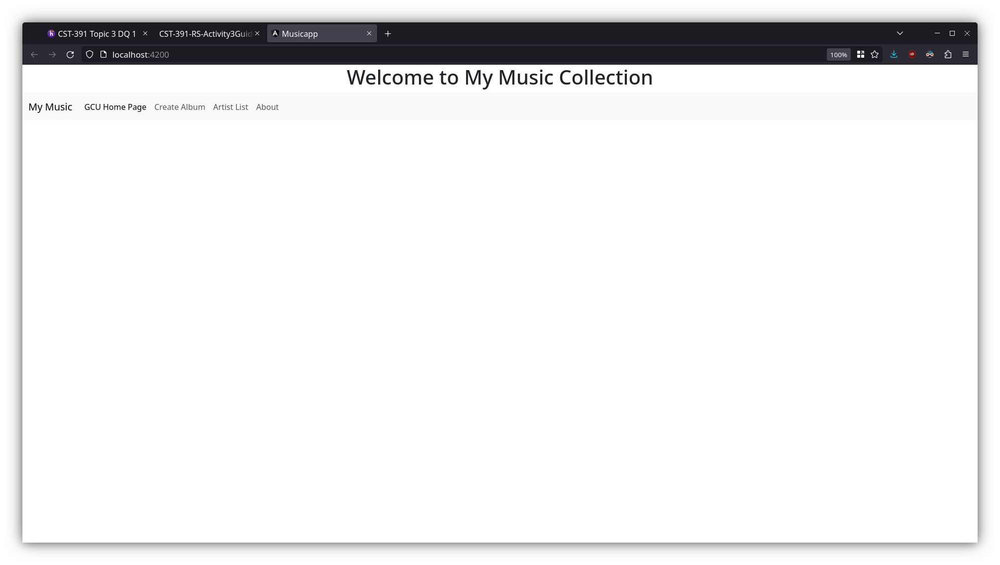
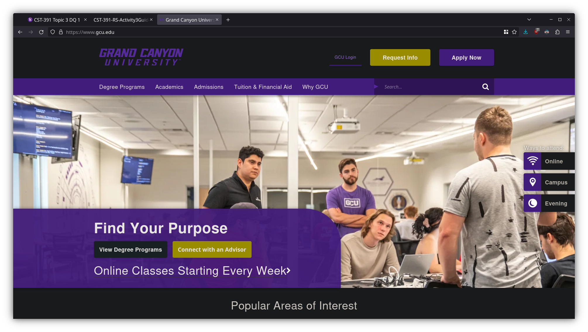
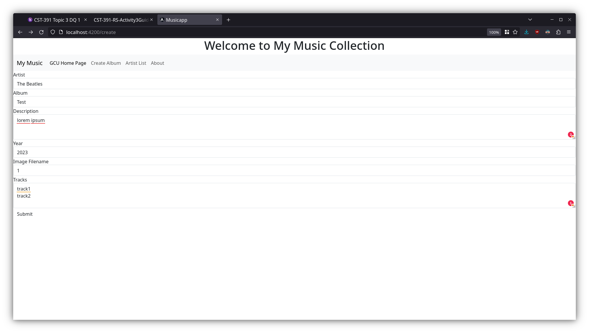
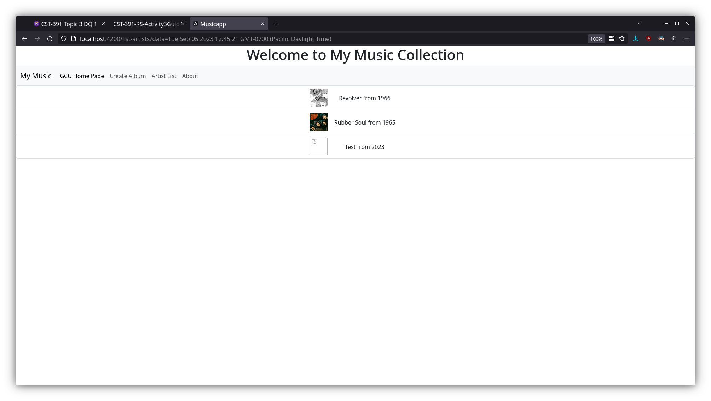
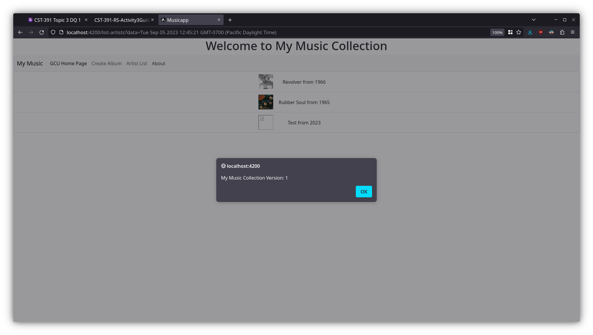

# Musicapp

This project was generated with [Angular CLI](https://github.com/angular/angular-cli) version 16.2.0.

## Development server

Run `ng serve` for a dev server. Navigate to `http://localhost:4200/`. The application will automatically reload if you change any of the source files.

## Screenshots
The initial application page

GCU homepage

Create Album page

Artist List page showing your added album/artist

About Box
