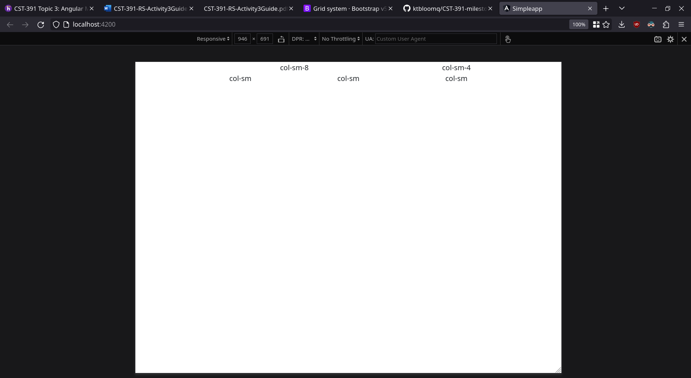
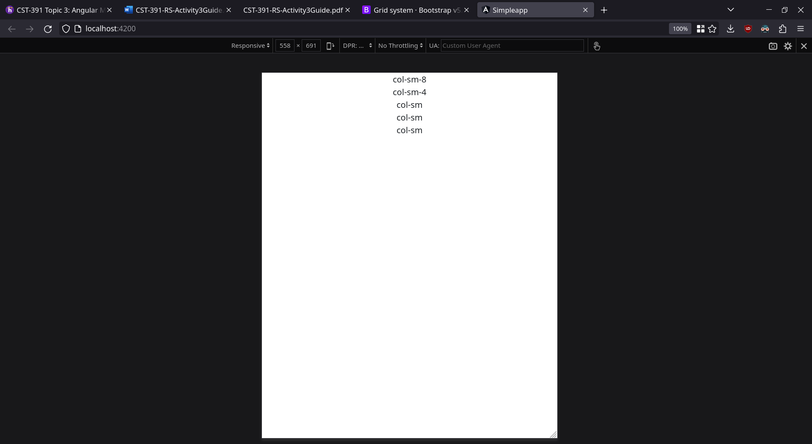

# Simpleapp

This project was generated with [Angular CLI](https://github.com/angular/angular-cli) version 16.2.0.

## Development server

Run `ng serve` for a dev server. Navigate to `http://localhost:4200/`. The application will automatically reload if you change any of the source files.

## Responsive Webpage Test
bootstrap grid expanded. 

bootstrap grid collapsed

## Form Screenshots
before username is input

form submission output

## Research
1. @Input indicates that the given field can be set in its html tag. 
2. In the info component, there is a dropdown list populated programatically. This is done with the following line: `<option *ngFor="let product of products" [value]="product">{{product}}</option>`. The parameter *ngFor calls a for loop to loop through each product in the products list. The [value] paramater defines the contents of each entry.
3. The info component also uses [(ngModel)]. This parameter binds the form contents with a variable.