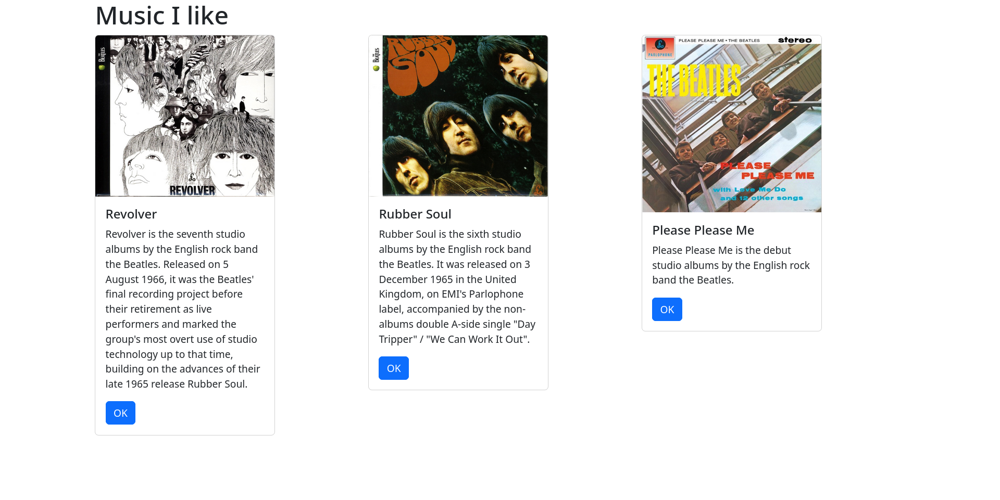
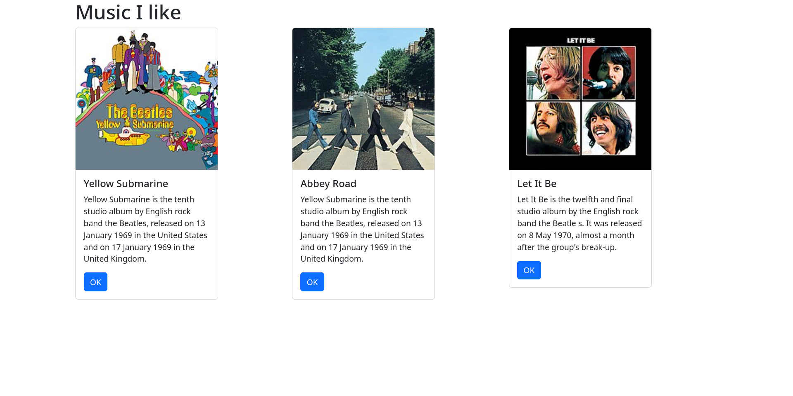

# Music App - React
## Part 1
In this part, I started rebuilding the music app in React. It uses Bootstrap cards to display albums. The app uses 3 main files: index.js, App.js, and Card.js. index.js simply renders App.js. App.js creates a bootsrtap grid with cards. Card.js takes in paramaters for the album title, description, image, and the button text.

## Part 2
In this part, I moved album data to a albumList. More specifically, I used a state to manage the list. This is useful because it allows the contents to be dynamically changed when I implement the music API

