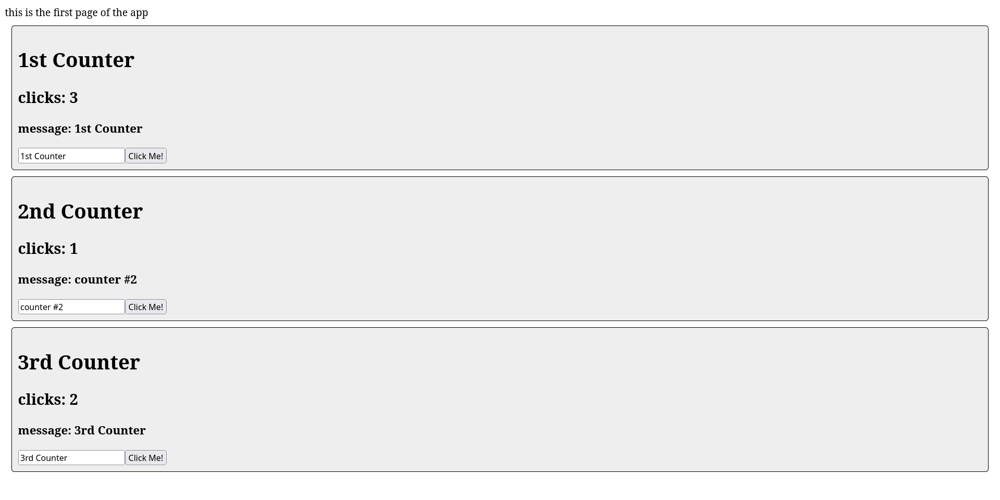

# State Changer Demo
This app is a test of how React state changes work. First, we use the "useState" hook to create a new state. It returns a getter and setter as an array. These states are then modified by the webapp using event handlers. In this case, the "onClick" and "onChange" event handlers were used.
