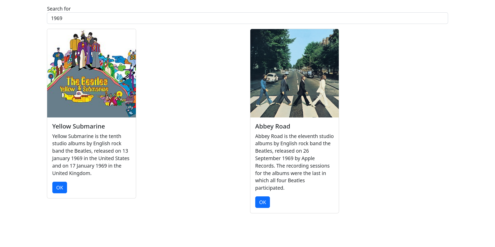
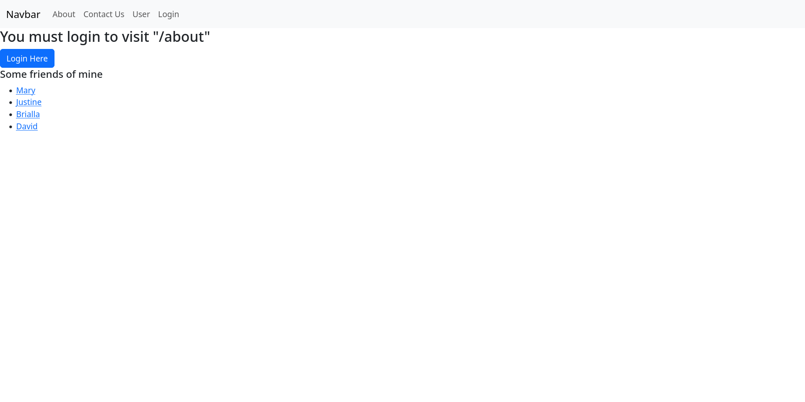
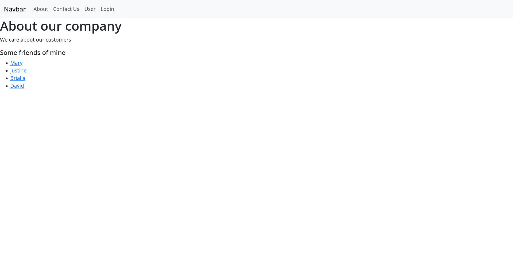

# Week 6 - API Integration
## Music React App
### Part 1
In this part, I replaced the placeholder album data with a request to musicAPI. Currently, all searches are handled client-side.

## Router Demo
This demo is an example of how React's router works. Routing is defined inside the JSX response of App.js. In addition, we have a basic authorization system. `isLoggedIn` is a state which defaults to false. Private pages wrapped with the `<PrivateRoute>` tag must login to access the page contents. After logging in, they will be redirected back to the target page.

