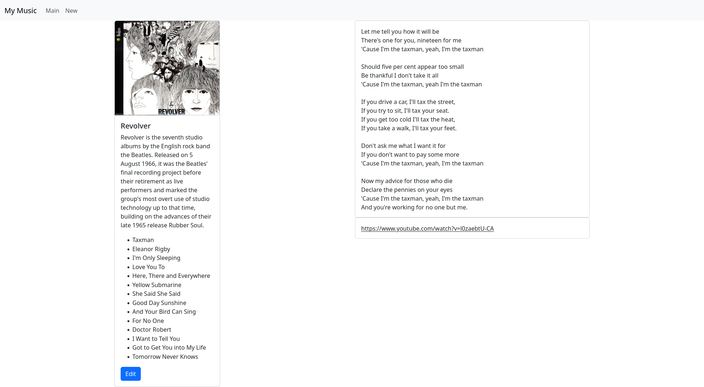

# Week 7
## Blog Demo
This demo showcases how an array can be dynamically modified in React. Here, blog posts can be created and deleted. Updates to the post list are caught by the useEffect hook which re-renders the posts. 

## Music App
### Part 1
In this update, I updated the UI to include track information. Each album card now displays a list of tracks. In the detailed view, these tracks can be clicked to reveal the lyrics for the song, and a link to play the track.

