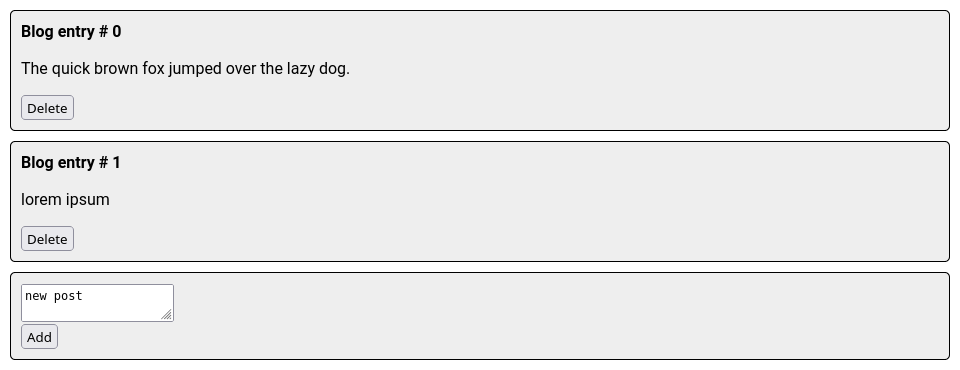

# Week 7
## Blog Demo
This demo showcases how an array can be dynamically modified in React. Here, blog posts can be created and deleted. Updates to the post list are caught by the useEffect hook which re-renders the posts. 

